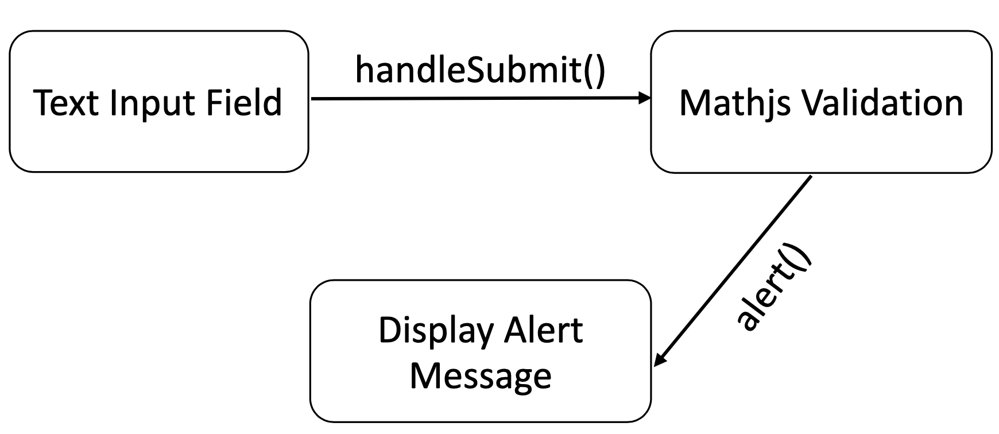

## Designing and Planning of Math Magic

This document explains the various phases of planning, design, development and future enhancements.

### Phase 1: Requirement Analysis

* Math Magic is focussed to cater the educational needs of second grade students who are our users.
* Specifically, this app focusses on training the users on addition.
* As a first step, research was conducted to identify the syllabus of second grade mathematics course so that the students are presented with problems that have the correct level of difficulty.
* Research revealed that using integers between 0 and 100 would be ideal for our users.
* To perform math operations, mathjs is used.
* The app is expected to display an arithmetic expression of the form "A + B = ?", where A and B are integers.
* The app accepts number inputs that is the sum of A and B.

### Phase 2: Designing the UI

* As we know, the users of Math Magic are second graders, a suitable color scheme that consists of bright colours like red, yellow and beige was identified after trying out different color schemes for the UI.
* Attractive logos, icons, and images were drawn using the chosen colors and styles, and custom fonts were used to make the UI appealing to second graders.
* Created UI layouts and positioned the various components at the right places such that our users are intrigued and the UI is self-explanatory.
* Multiple CSS styling has also been implemented to enhance user experience and satisfaction.

### Phase 3: Implementing the logic

* The app uses React Router to display the tutorial page in a div below.  The navigation is implemented using BrowserRouter, NavLink and Routes to enhance the interaction between users and application.
* Random integers are generated using the Math.randomInt() method from mathjs and are rendered in pre-chosen style.
* When the user inputs the answer in the text input, the handleChange() method takes care of displaying the typed input in the textbox.
* Form validation is implemented, where the app allows only numbers as input.
* Once the user clicks the Submit button, the handleSubmit() method validates the input and checks if the input is equal to the actual sum using the Math.equal() method.  The actual sum is calculated using the Math.sum() method.
* If the answer is correct, an alert message is triggered saying that the answer is correct and a new problem is presented.
* If the answer is wrong, an alert message is triggered saying that the answer is wrong and the text input field is reset.

### Additional Enhancements

* Limiting the number of incorrect answers - IMPLEMENTED
    * This feature has been implemented in this app successfully.  This is done by maintaining a common variable initialised to the number of allowed attempts and decrementing it for every wrong attempt.
    * After all attempts are over, the correct answer is displayed for the user to learn and a new problem is presented.
* Keeping a running total score
    * This feature can be implemented by initialising a static variable and incrementing it for every correct answer.
* Adding a timer
    * A naive approach would be to keep subtracting the current system time from the current system time + required time to solve the problem (say, 2 mins), i.e., newTime = currSysTime + 2 and perform diffInTime = newTime - currSysTime and invoke a function when the diffInTime becomes zero.
    * Alternatively, we can use setTimeout() method to achieve this.
* Maintaining a history of questions
    * This can be achieved by maintaing a static string array where every question is appended once it is generated.

### Further UI enhancements

* To make it more fun and attractive to our users (second graders), we can create graphical effects using react-confetti and other gifs and animation.
* We can also implement an animated character that guides our users if and when they give wrong answers.
